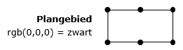

# Het bestemmingsplan {#2DE68A05}

Dit hoofdstuk bevat de normen die van toepassing zijn op de vormgeving, inrichting en toegankelijkheid van het bestemmingsplan als geheel. 
## Opbouw van het bestemmingsplan {#625F0276}

Het centrale onderdeel van een bestemmingsplan wordt gevormd door de bestemmingen, die altijd betrekking hebben op geometrisch bepaalde vlakken. Aan het in het plan begrepen grondgebied worden bestemmingen toegewezen met bijbehorende regels. De regels gekoppeld aan bestemmingen betreffen het gebruik (in ruime zin) van het in het plan begrepen grondgebied en van de zich daar bevindende bouwwerken. Kenmerk van bestemmingsplannen is dat het gehele plangebied bedekt is met bestemmingen. Bij inpassingsplannen die alleen iets toevoegen aan of verwijderen uit de vigerende bestemmingen en/of bijbehorende regels is de vereiste van een door bestemming vlakdekkend plangebied niet van toepassing. Ook bij een wijzigingsplan hoeft het plangebied niet volledig te worden bedekt door bestemmingen.

Een bestemmingsplan kan ook dubbelbestemmingen bevatten. Ook deze hebben altijd betrekking op geometrisch bepaalde vlakken. Dubbelbestemmingen overlappen bestemmingen en geven eigen regels, waarbij sprake is van een rangorde tussen de bestemmingen en de dubbelbestemmingen. De dubbelbestemmingen hoeven niet het gehele plangebied te bedekken.

Een bestemmingsplan kan ook aanduidingen bevatten om bepaalde zaken binnen een bestemming of dubbelbestemming nader of specifieker te regelen. Het gaat hierbij om specificaties met betrekking tot gebruik- of bouwmogelijkheden. De bestemmingen en aanduidingen hebben juridische betekenis en moeten altijd in de regels van het bestemmingsplan voorkomen.

Verklaringen hebben geen juridische betekenis en zijn om die reden geen onderdeel van het bestemmingsplan.

Ingeval sprake is van een gemeentelijk bestemmingsplan, waarvan het onderwerp gemeentegrens overschrijdend is, wordt dit plan voor elk van de betreffende gemeenten apart vastgesteld voor zover het haar eigen grondgebied betreft. Voor provinciegrensoverschrijdende plannen geldt dat eveneens, voor zover deze door meerdere provincies worden opgesteld. 
## Digitale verbeelding van het bestemmingsplan {#2DE68A12}

De informatie die is vastgelegd in het plan moet in elektronische vorm volledig toegankelijk en raadpleegbaar zijn. Dit wordt de digitale verbeelding genoemd. De digitale verbeelding is de verbeelding van het bestemmingsplan in een interactieve raadpleegomgeving, waarin alle relevante bestemmingsplaninformatie wordt getoond: de combinatie van (plan)kaart en regels met de toelichting. Een raadpleger van het bestemmingsplan moet alle relevante bestemmingsplaninformatie op eenvoudige wijze voor ogen kunnen krijgen.

De relevante bestemmingsplaninformatie heeft betrekking op de bestemmingen, dubbelbestemmingen en aanduidingen met bijbehorende regels in het bestemmingsplan. Voor zowel bestemmingen als aanduidingen geldt, dat deze zonder interactie zichtbaar moeten zijn in de digitale verbeelding. Uit interactie met de digitale verbeelding blijkt dan de inhoud van de bestemming en/of aanduiding.

Bestemmingen, dubbelbestemmingen en aanduidingen moeten in alle interactieve raadpleegomgevingen op dezelfde en in deze standaard aangegeven wijze digitaal worden verbeeld door middel van kleuren en symboliek. De digitale verbeelding kent geen vaste indeling van de legenda. De wijze waarop de planregels in beeld worden gebracht, kunnen worden opgevraagd en gecombineerd, is niet aan regels gebonden. Bij het raadplegen van een digitale verbeelding moet het mogelijk zijn om te kunnen meten.

In een bestemmingsplanprocedure wordt gebruik gemaakt van een topografische ondergrond. Deze ondergrond maakt geen deel uit van het bestemmingsplan zelf. In de digitale verbeelding kunnen andere (topografische) ondergronden worden gebruikt dan de ondergronden die gebruikt zijn tijdens de procedure en bij de vaststelling.

In de digitale verbeelding wordt de begrenzing van het plangebied weergegeven met een ononderbroken bolletjeslijn, conform de specificatie in . 
<figure></img>
<figcaption>Verbeelding plangebied</figcaption></figure>

