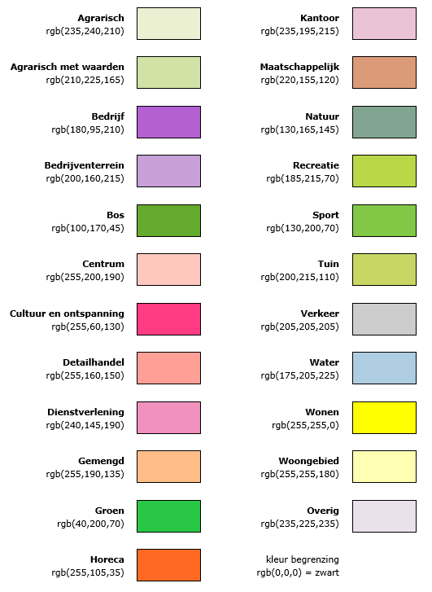

# Bestemmingen {#6461A652}

Dit hoofdstuk bevat de normen die van toepassing zijn op de vormgeving en inrichting van de bestemmingen in een bestemmingsplan. 
## Algemeen {#2DE68A28}

Dit hoofdstuk is van toepassing op bestemmingen die ingevolge artikel 3.1 Wro aan gronden worden toegekend. Met een bestemming wordt tot uitdrukking gebracht welke gebruiksdoelen of functies, met het oog op een goede ruimtelijke ordening, aan de in het plan begrepen gronden zijn toegekend. Niet iedere functie leent zich voor een eigen bestemming. Of dit zo is, hangt af van de ruimtelijke relevantie, of wel van de mate waarin de betrokken functie invloed heeft op zijn omgeving of daaraan eisen stelt. Behalve om functies gaat het bij bestemmingen altijd om concreet ruimtegebruik of om fysiek aanwezige ruimtelijke objecten. Een bestemming heeft altijd betrekking op een geometrisch bepaald vlak. Bestemmingen in de vorm van een lijn of een punt komen niet voor. 
## Hoofdgroepen van bestemmingen {#2DE68A2B}

Ten behoeve van de eenduidigheid in de naamgeving en digitale verbeelding van bestemmingen is er een bindende lijst met  hoofdgroepen van bestemmingen opgesteld. Als hoofdgroepen van bestemmingen zijn aangemerkt en mogen worden gebruikt:

<ul><li>Agrarisch;</li>
<li>Agrarisch met waarden;</li>
<li>Bedrijf;</li>
<li>Bedrijventerrein;</li>
<li>Bos;</li>
<li>Centrum;</li>
<li>Cultuur en ontspanning;</li>
<li>Detailhandel;</li>
<li>Dienstverlening;</li>
<li>Gemengd;</li>
<li>Groen;</li>
<li>Horeca;</li>
<li>Kantoor;</li>
<li>Maatschappelijk;</li>
<li>Natuur;</li>
<li>Recreatie;</li>
<li>Sport;</li>
<li>Tuin;</li>
<li>Verkeer;</li>
<li>Water;</li>
<li>Wonen;</li>
<li>Woongebied;</li>
<li>Overig.</li>
</ul>

Van iedere specifieke bestemming, voorlopige bestemming en uit te werken bestemming wordt door de bronhouder vastgelegd onder welke hoofdgroep deze valt. In de digitale verbeelding krijgen alle geometrisch bepaalde vlakken waar de bestemmingen, voorlopige bestemmingen en uit te werken bestemmingen betrekking op hebben, de kleur van de hoofdgroep waar deze onder valt, conform de specificatie in . De begrenzing van deze vlakken wordt weergegeven door een ononderbroken lijn. Er wordt in de digitale verbeelding geen gebruik gemaakt van lettercodes. 
<figure></img>
<figcaption>Verbeelding hoofdgroepen van bestemmingen</figcaption></figure>

## Naam van een bestemming {#2DE68AA3}

Iedere bestemming heeft een naam. Voor de naam van een bestemming zijn vier varianten mogelijk:

<b>Variant 1 - naam van de hoofdgroep hanteren</b> 
De naam van de bestemming begint met een hoofdletter en is verder gelijk aan de naam van de hoofdgroep. De naam van de bestemming wordt als volgt opgenomen:

&lt;&lt;Naam hoofdgroep&gt;&gt; 
<i>Voorbeeld: Agrarisch</i>

<b>Variant 2 - specifieke bestemmingsbenaming gebruiken</b> 
Nadere specificatie van een bestemming is mogelijk door achter de naam van de hoofdgroep een specifieke bestemmingsbenaming te zetten. Hierdoor ontstaat een aparte bestemming met eigen regels. Van deze mogelijkheid wordt gebruik gemaakt wanneer zich binnen dezelfde hoofdgroep functies voordoen die qua ruimtelijke kenmerken en effecten grote verschillen vertonen en het niet wenselijk is al die functies op een bepaalde plaats toe te laten. De naam van de gespecificeerde bestemming bestaat uit de naam van de hoofdgroep gevolgd door de naam van de specificatie.

Ten behoeve van de eenduidigheid in de naamgeving en digitale verbeelding van bestemmingen is een functielijst opgesteld die als separate bijlage naast deze standaard van toepassing is. In deze lijst wordt voor een aantal functies een vaste hoofdgroep voorgeschreven. Voor de functies in de functielijst zijn geen definities of voorwaarden met betrekking tot inhoud opgesteld. Als een specifieke bestemmingsbenaming wordt gekozen waarbij de specificatie op de functielijst voorkomt, dan moet de in de functielijst gegeven hoofdgroep worden gebruikt. Komt de specificatie niet voor op de lijst of is er geen hoofdgroep bij de functie gegeven, dan kiest de bronhouder zelf de hoofdgroep die het meest van toepassing is. In afwijking van de hoofdgroep zoals vastgelegd in deze functielijst kunnen in alle gevallen ook de hoofdgroepen Centrum of Gemengd gespecificeerd worden. 
Een functie kan ook als functieaanduiding in elke gewenste bestemming worden gebruikt (zie paragraaf <a href='#45B24E21'>5.3</a>).

De naam van een gespecificeerde bestemming wordt als volgt opgenomen, waarbij de eerste letter van de hoofdgroep en de eerste letter van de specificatie beginnen met een hoofdletter:

&lt;&lt;Naam hoofdgroep&gt;&gt; [spatie] [-] [spatie] &lt;Specificatie van de bestemming&gt; 
<i>Voorbeeld: Agrarisch – Akkerbouw</i>

<b>Variant 3 - Bestemming splitsen</b> 
Splitsing van bestemmingen wordt gebruikt wanneer zich binnen dezelfde bestemming geheel verschillende stedenbouwkundige situaties voordoen die om heel verschillende bouwregels vragen. Daarnaast wordt splitsing gebruikt wanneer binnen dezelfde hoofdgroep diverse pakketten aan functies zijn te onderscheiden en er zonder splitsing een opeenhoping aan functieaanduidingen zou ontstaan. Bij splitsing van bestemmingen wordt altijd van Arabische cijfers gebruik gemaakt. De eerste letter van de hoofdgroep begint met een hoofdletter. De naam van een gesplitste bestemming wordt als volgt opgenomen, waarbij de eerste letter van de hoofdgroep begint met een hoofdletter:

&lt;&lt;Naam hoofdgroep&gt;&gt; [spatie] [-] [spatie] &lt;cijfer&gt; 
<i>Voorbeeld : Gemengd – 1</i>

In het geval dat een bestemming wordt gesplitst waarvoor een specifieke bestemmingsbenaming is gespecificeerd, wordt de naam van de bestemming als volgt opgenomen, waarbij de eerste letter van de hoofdgroep en de eerste letter van de specificatie beginnen met een hoofdletter:

&lt;&lt;Naam hoofdgroep&gt;&gt; [spatie] [-] [spatie] &lt;Specificatie van de bestemming&gt; [spatie] &lt;cijfer&gt; 
<i>Voorbeeld 1: Water – Vaarwegen 1</i> 
<i>Voorbeeld 2: Water – Vaarwegen 2</i>

<b>Variant 4 - Bestemming onder de hoofdgroep Overig</b> 
Het kan in bijzondere situaties voorkomen dat een bestemming echt niet onder een hoofdgroep is te plaatsen anders dan onder de hoofdgroep Overig. In dat geval mag gebruik gemaakt worden van deze hoofdgroep, mits dit in de toelichting van het bestemmingsplan wordt gemotiveerd.

Deze laatste variant is alleen van toepassing op bestemmingen die onder de hoofdgroep Overig vallen. De overige varianten zijn niet van toepassing op bestemmingen die onder de hoofdgroep Overig vallen.  De naam een bestemming onder de hoofdgroep Overig begint altijd met een hoofdletter en wordt opgenomen zonder naar de naam van de hoofdgroep te verwijzen, als volgt:

&lt;Specificatie van de bestemming&gt; 
<i>Voorbeeld : Enclave</i> 
## Naam van een voorlopige bestemming {#2DE68ACB}

Iedere voorlopige bestemming heeft een naam. De naam van een voorlopige bestemming wordt als volgt opgenomen:

&lt;&lt;Naam hoofdgroep&gt;&gt; [spatie] [-] [spatie] [Voorlopig] 
<i>Voorbeeld: Agrarisch – Voorlopig</i>

In het geval dat een voorlopige bestemming wordt gesplitst, wordt de naam van de bestemming als volgt opgenomen, waarbij de eerste letter van de hoofdgroep en de eerste letter van de specificatie beginnen met een hoofdletter:

&lt;&lt;Naam hoofdgroep&gt;&gt; [spatie] [-] [spatie] &lt;Specificatie van de bestemming&gt; [spatie] [Voorlopig] 
<i>Voorbeeld: Agrarisch – Grondgebonden Voorlopig</i> 
&lt;&lt;Naam hoofdgroep&gt;&gt; [spatie] [-] [spatie] [Voorlopig] [spatie] &lt;cijfer&gt; 
<i>Voorbeeld: Agrarisch – Voorlopig 1</i> 
## Naam van een uit te werken bestemming {#2DE68AD8}

Iedere uit te werken bestemming heeft een naam. De naam van een uit te werken bestemming wordt als volgt in het bestemmingsplan opgenomen:

&lt;&lt;Naam hoofdgroep&gt;&gt; [spatie] [-] [spatie] [Uit te werken] 
<i>Voorbeeld: Agrarisch – Uit te werken</i>

In het geval dat een uit te werken bestemming wordt gesplitst, wordt de naam van de bestemming als volgt opgenomen, waarbij de eerste letter van de hoofdgroep en de eerste letter van de specificatie beginnen met een hoofdletter:

&lt;&lt;Naam hoofdgroep&gt;&gt; [spatie] [-] [spatie] &lt;Specificatie van de bestemming&gt; [spatie] [Uit te werken] 
<i>Voorbeeld: Agrarisch – Grondgebonden Uit te werken</i> 
&lt;&lt;Naam hoofdgroep&gt;&gt; [spatie] [-] [spatie] [Uit te werken] [spatie] &lt;cijfer&gt; 
<i>Voorbeeld: Agrarisch – Uit te werken 1</i> 
## Vermelding van bestemmingen in de planregels {#2DE68AE5}

Een bestemming wordt als volgt in de bestemmingsomschrijving in de planregels opgenomen:

[De voor ] [‘] &lt;Naam bestemming&gt; [’] [ aangewezen gronden zijn bestemd voor ] 
<i>Voorbeeld: De voor ‘Agrarisch’ aangewezen gronden zijn bestemd voor ...</i>

In overige gevallen wordt de bestemming als volgt in de planregels opgenomen:

[‘] &lt;Naam bestemming&gt; [’] 
<i>Voorbeeld: ‘Agrarisch’</i>

Bij het opnemen van bestemmingen wordt in de planregels geen gebruik gemaakt van lettercodes. 
