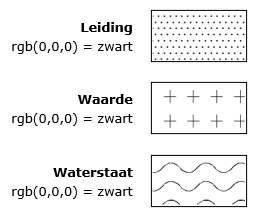

## Dubbelbestemmingen

Dit hoofdstuk bevat de normen die van toepassing zijn op de vormgeving en inrichting van de dubbelbestemmingen in een bestemmingsplan.

### Algemeen

Er is sprake van een dubbelbestemming indien op een stuk grond twee of meer onafhankelijk van elkaar voorkomende bestemmingen voorkomen, waarbij er sprake is van een rangorde tussen de dubbelbestemming en de daarmee samenvallende bestemming. In de planregels wordt de verhouding tussen de functies van beide bestemmingen aangegeven.

De specifieke kenmerken van dubbelbestemmingen brengen met zich mee dat deze een willekeurig gebied ten opzicht van bestemmingen beslaan; soms meerdere bestemmingen deels of geheel overlappend, soms binnen een bestemming. Een dubbelbestemming heeft altijd betrekking op een geometrisch bepaald vlak. Dubbelbestemmingen in de vorm van een lijn of een punt komen niet voor.

### Hoofdgroepen van dubbelbestemmingen

Ten behoeve van de eenduidigheid in de naamgeving en digitale verbeelding van dubbelbestemmingen is er een bindende lijst met hoofdgroepen van dubbelbestemmingen opgesteld. Als hoofdgroepen van dubbelbestemmingen zijn aangemerkt en mogen worden gebruikt:

<ul><li>Leiding;</li>
<li>Waarde;</li>
<li>Waterstaat.</li>
</ul>

Van iedere specifieke dubbelbestemming is door de bronhouder vastgelegd onder welke hoofdgroep deze valt.

In de digitale verbeelding worden alle geometrisch bepaalde vlakken waar de dubbelbestemmingen betrekking op hebben, weergegeven door zwarte vlakpatronen, conform de specificatie in Figuur 3. De begrenzing van deze vlakken wordt weergegeven door een ononderbroken lijn. In verband met de raadpleegbaarheid is het mogelijk in de kolom- en rijafstanden van de patronen te variëren. Er wordt in de digitale verbeelding geen gebruik gemaakt van lettercodes.

<figure></img>
<figcaption>Verbeelding hoofdgroepen van dubbelbestemmingen</figcaption></figure>

### Naam van een dubbelbestemming

Iedere dubbelbestemming heeft een naam. Voor de specificatie van de naam van een dubbelbestemming is paragraaf <a href='#_Ref303077960'>3.3 van toepassing.

### Vermelding van dubbelbestemmingen in de planregels

Een dubbelbestemming wordt als volgt in de bestemmingsomschrijving in de planregels opgenomen:

\[De voor \] \[‘\] \<Naam dubbelbestemming\> \[’\] \[ aangewezen gronden zijn, behalve voor de andere daar voorkomende bestemming(en), mede bestemd voor\]

<i>Voorbeeld: De voor ‘Waterstaat - Waterberging’ aangewezen gronden zijn, behalve voor de andere daar voorkomende bestemming(en), mede bestemd voor ...</i>

In overige gevallen wordt de dubbelbestemming als volgt in de planregels opgenomen:

\[‘\] \<Naam dubbelbestemming\> \[’\]

<i>Voorbeeld : ‘Waterstaat - Waterberging’</i>

Bij het opnemen van dubbelbestemmingen wordt in de planregels geen gebruik gemaakt van lettercodes.

