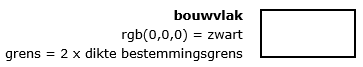
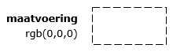
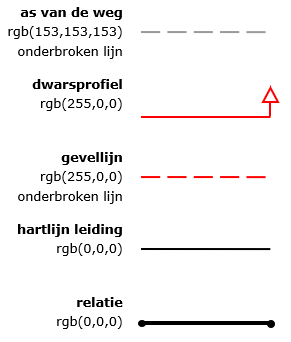
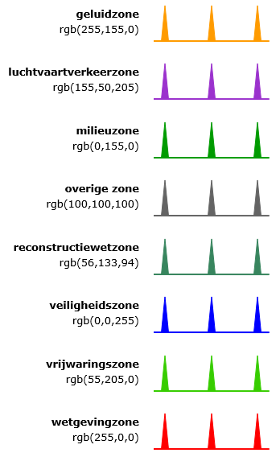

# Aanduidingen {#42FA4C1B}

Dit hoofdstuk bevat de normen die van toepassing zijn op de vormgeving en inrichting van de aanduidingen in een bestemmingsplan. 
## Algemeen {#2DE68B27}

Behalve bestemmingen en dubbelbestemmingen zijn binnen het bestemmingsplan aanduidingen te onderscheiden. Aanduidingen bevatten specificaties van bestemmingen en dubbelbestemmingen met betrekking tot gebruik of bouwen. Aanduidingen hebben altijd juridische betekenis waardoor zij niet alleen voorkomen in de digitale verbeelding van een bestemmingsplan, maar ook in de planregels. 
Er zijn zes soorten aanduidingen te onderscheiden: 
<ul><li>bouwvlak;</li>
<li>functieaanduiding;</li>
<li>bouwaanduiding;</li>
<li>maatvoering;</li>
<li>figuur;</li>
<li>gebiedsaanduiding.</li>
</ul>

Met uitzondering van de aanduiding figuur zijn de hiervoor genoemde aanduidingen geometrisch begrensd en hebben zij altijd betrekking op een vlak. Een figuur bestaat altijd uit lijnstukken. 
## Bouwvlak {#6C0EEE84}

Een bouwvlak is een aanduiding waarvan er slechts één soort is. De naam van het bouwvlak wordt met kleine letters geschreven en wordt als volgt opgenomen:

[bouwvlak] 
<i>Voorbeeld: bouwvlak</i>

In de digitale verbeelding wordt de begrenzing van een bouwvlak weergegeven met een dikke ononderbroken lijn, conform de specificatie in . Er wordt in de digitale verbeelding geen gebruik gemaakt van lettercodes. 
<figure></img>
<figcaption>Verbeelding bouwvlakken</figcaption></figure>

## Functieaanduiding {#45B24E21}

Een functieaanduiding wordt gebruikt om de gebruiksmogelijkheden binnen een bestemmingsvlak of een gedeelte daarvan nader te specificeren. Zo kan worden aangegeven dat ter plaatse alleen een bepaalde, met name genoemde functie is toegestaan of juist is uitgesloten. Functieaanduidingen kunnen ook worden gebruikt om op een bepaalde locatie een specifieke, niet bij de bestemming passende, functie toe te laten of om functies binnen een bestemming in boven elkaar gestapelde lagen mogelijk te maken.

Iedere functieaanduiding heeft een naam. De naam van een functieaanduiding wordt geschreven met kleine letters. Voor de naam van een functieaanduiding zijn twee varianten mogelijk:

<b>Variant 1 - aanduiding uit de functielijst opnemen</b> 
Er is een functielijst opgesteld die als separate bijlage naast deze standaard van toepassing is. Indien er gebruik wordt gemaakt van een functie wordt die voorkomt op deze lijst, dan wordt de naam van de functieaanduiding als volgt opgenomen:

&lt;&lt;functieaanduiding&gt;&gt; 
<i>Voorbeeld: bedrijfswoning</i>

In het geval dat een functie die voorkomt op de functielijst niet is toegestaan op een locatie in het bestemmingsplan, wordt deze negatieve functieaanduiding als volgt opgenomen:

&lt;functieaanduiding&gt; [spatie] [uitgesloten] 
<i>Voorbeeld: bedrijfswoning uitgesloten</i>

<b>Variant 2 - specifieke functie opnemen</b> 
Naast het werken met functies van de functielijst mag er als dat nodig is voor een goede ruimtelijke ordening ook gewerkt worden met specifieke functies. Een specifieke functie is een functie die niet voorkomt op de functielijst. De specificatie bestaat uit een of meer toepasselijke woorden of een Arabisch cijfer. De naam van een specifieke functie wordt geheel met kleine letters geschreven en wordt als volgt opgenomen:

[specifieke vorm van] [spatie] &lt;&lt;hoofdgroep &gt;&gt; [spatie] [-] [spatie] &lt;specificatie&gt; 
<i>Voorbeeld 1: specifieke vorm van agrarisch </i>–<i> kalvermesterij</i> 
<i>Voorbeeld 2: specifieke vorm van maatschappelijk – 1</i>

Voor de &lt;&lt;hoofdgroep&gt;&gt; wordt gekozen uit een van de hoofdgroepen die gehanteerd worden bij bestemmingen en dubbelbestemmingen, behalve de hoofdgroep ‘overig’. Hierbij wordt de hoofdgroep gekozen die hoort bij de specifieke functie, ook al ligt deze in een vlak met een bestemming van een andere hoofdgroep.  De gegeven specificatie of het cijfer moet corresponderen met in de planregels genoemde functies.

In het geval dat een specifieke functie niet is toegestaan op een locatie in het bestemmingsplan, wordt deze uitgesloten functie als volgt opgenomen:

[specifieke vorm van] [spatie] &lt;&lt;hoofdgroep&gt;&gt; [spatie] [uitgesloten] [spatie] [-] [spatie] &lt;specificatie&gt; 
<i>Voorbeeld: specifieke vorm van recreatie uitgesloten - groepsverblijf</i>

In de digitale verbeelding wordt de begrenzing van een functieaanduiding weergegeven met een onderbroken lijn, conform de specificatie in . Er wordt in de digitale verbeelding geen gebruik gemaakt van lettercodes. 
<figure></img>
<figcaption>Verbeelding functieaanduidingen</figcaption></figure>

## Bouwaanduiding {#2DE68B69}

Bouwaanduidingen zijn alle in het bestemmingsplan aanwezige aanduidingen met betrekking tot de wijze van bouwen en de verschijningsvorm van bouwwerken. De volgende bouwaanduidingen mogen worden gebruikt: 
<ul><li>aaneengebouwd;</li>
<li>antennemast;</li>
<li>bijgebouwen;</li>
<li>gestapeld;</li>
<li>kap;</li>
<li>karakteristiek;</li>
<li>nokrichting;</li>
<li>onderdoorgang;</li>
<li>plat dak;</li>
<li>twee-aaneen;</li>
<li>vrijstaand;</li>
<li>specifieke bouwaanduiding.</li>
</ul>

De naam van de bouwaanduiding wordt met kleine letters geschreven. Voor de naam van een bouwaanduiding zijn twee varianten mogelijk:

<b>Variant 1 – bouwaanduiding uit de lijst opnemen</b> 
In deze variant wordt de bouwaanduiding als volgt opgenomen:

&lt;&lt;bouwaanduiding&gt;&gt; 
<i>Voorbeeld: aaneengebouwd</i>

In het geval dat een bepaalde bouwaanduiding niet is toegestaan op een locatie in het bestemmingsplan, wordt gebruik gemaakt van een negatieve bouwaanduiding. De naam van de negatieve bouwaanduiding wordt met kleine letters geschreven en wordt als volgt opgenomen:

&lt;&lt;bouwaanduiding&gt;&gt; [spatie] [uitgesloten] 
<i>Voorbeeld: aaneengebouwd uitgesloten</i>

<b>Variant 2 - specifieke bouwaanduiding opnemen</b>

Naast het werken met bouwaanduidingen uit bovenstaande lijst mag er met het oog op een goede ruimtelijke ordening ook gewerkt worden met specifieke bouwaanduidingen. Een specifieke aanduiding is een bouwaanduiding die niet voorkomt op de bovenstaande lijst. De specificatie bestaat uit een of meer toepasselijke woorden of een Arabisch cijfer. De naam van een specifieke aanduiding wordt met kleine letters geschreven en wordt als volgt opgenomen:

[specifieke bouwaanduiding] [spatie] [-] [spatie] &lt;specificatie&gt;

<i>Voorbeeld 1: specifieke bouwaanduiding – stolp</i> 
<i>Voorbeeld 2: specifieke bouwaanduiding – 1</i>

De gegeven specificatie of het cijfer moeten corresponderen met een in de planregels opgenomen regel inzake de wijze van bouwen of de verschijningsvorm daarvan, zo nodig per bestemming, dubbelbestemming, gebiedsaanduiding of functieaanduiding.

In het geval dat een bepaalde bouwwijze of verschijningsvorm niet is toegestaan op een locatie in het bestemmingsplan, wordt gebruik gemaakt van een negatieve specifieke aanduiding. De naam van de negatieve verzamelaanduiding wordt met kleine letters geschreven en wordt als volgt opgenomen:

[specifieke bouwaanduiding uitgesloten] [spatie] [-] [spatie] &lt;specificatie&gt; 
<i>Voorbeeld 1: specifieke bouwaanduiding uitgesloten – stolp</i> 
<i>Voorbeeld 2: specifieke bouwaanduiding uitgesloten – 1</i>

In de digitale verbeelding wordt de begrenzing van een bouwaanduiding weergegeven met een onderbroken lijn, conform de specificatie in . Er wordt in de digitale verbeelding geen gebruik gemaakt van lettercodes. 
<figure></img>
<figcaption>Verbeelding bouwaanduidingen</figcaption></figure>

## Maatvoering {#2DE68B9E}

Maatvoeringsaanduidingen zijn alle aanduidingen die betrekking hebben op afmetingen, percentages, oppervlakten, hellingshoeken en aantallen, zowel ten aanzien van het bouwen als ten aanzien van het gebruik. De volgende aanduidingen mogen, al dan niet in combinatie, worden gebruikt:

<ul><li>aantal;</li>
<li>aantal aaneen te bouwen wooneenheden;</li>
<li>aantal bedrijven;</li>
<li>aantal bezoekers;</li>
<li>aantal bouwlagen;</li>
<li>aantal gebouwen;</li>
<li>aantal parkeerplaatsen;</li>
<li>aantal rijstroken;</li>
<li>aantal sporen;</li>
<li>aantal winkels;</li>
<li>aantal wooneenheden;</li>
<li>bebouwd oppervlak (m2);</li>
<li>bebouwingspercentage (%);</li>
<li>bouwhoogte (m);</li>
<li>breedte (m);</li>
<li>dakhelling (graden);</li>
<li>diepte (m);</li>
<li>goothoogte (m);</li>
<li>hoogte (m);</li>
<li>hoogteligging vlak (m);</li>
<li>lengte (m);</li>
<li>maatvoering;</li>
<li>oppervlakte (m2);</li>
<li>verticale bouwdiepte (m);</li>
<li>vloeroppervlakte (m2);</li>
<li>vloeroppervlakte; bruto (m2);</li>
<li>vloeroppervlakte; bvo (m2);</li>
<li>vloeroppervlakte; netto (m2);</li>
<li>vloeroppervlakte; vvo (m2);</li>
<li>volume (m3).</li>
</ul>

De naam van de maatvoeringsaanduiding wordt met kleine letters geschreven. Voor de naam van een maatvoeringsaanduiding zijn drie varianten mogelijk:

<b>Variant 1 - maatvoering uit de lijst gebruiken</b> 
In deze variant wordt een maatvoeringsaanduiding uit bovenstaande lijst gebruikt. Bij iedere aanduiding behalve bij de aanduidingen ‘aantal’ en ‘maatvoering’ kan de aanduiding voorafgegaan worden door het voorvoegsel [minimum] of [maximum]. De naam van deze aanduidingen wordt als volgt opgenomen:

&lt;&lt;maatvoeringsaanduiding&gt;&gt; 
<i>Voorbeeld: bouwhoogte (m)</i> 
of 
[minimum] [spatie] &lt;&lt;maatvoeringsaanduiding&gt;&gt; 
<i>Voorbeeld: minimum bouwhoogte (m)</i> 
of 
[maximum] [spatie] &lt;&lt;maatvoeringsaanduiding&gt;&gt; 
<i>Voorbeeld: maximum bouwhoogte (m)</i>

<b>Variant 2 - specifieke maatvoeringsaanduiding gebruiken</b> 
Naast het werken met maatvoeringsaanduidingen uit bovenstaande lijst mogen als dat wenselijk is voor een goede ruimtelijke ordening de volgende specifieke maatvoeringsaanduidingen in een bestemmingsplan gebruikt worden: 
<ul><li>maximaal drie maatvoeringsaanduidingen die niet in bovenstaande lijst voorkomen en die beginnen met het voorvoegsel [minimum];</li>
<li>maximaal drie maatvoeringsaanduidingen die niet in bovenstaande lijst voorkomen en die beginnen met het voorvoegsel [maximum];</li>
<li>maximaal drie maatvoeringsaanduidingen die niet in bovenstaande lijst voorkomen en die niet beginnen met een van beide voorvoegsels.</li>
</ul>

De naam van deze aanduidingen wordt als volgt opgenomen:

&lt;maatvoeringsaanduiding&gt; 
<i>Voorbeeld: aantal bedrijfswoningen</i>

of 
[minimum] [spatie] &lt;maatvoeringsaanduiding&gt; 
<i>Voorbeeld: minimum aantal bedrijfswoningen</i>

of 
[maximum] [spatie] &lt;maatvoeringsaanduiding&gt; 
<i>Voorbeeld: maximum aantal bedrijfswoningen</i>

<b>Variant 3 - gecombineerde maatvoeringsaanduiding gebruiken</b> 
In deze variant worden maatvoeringsaanduidingen conform variant 1 en/of 2 gecombineerd opgenomen. Alle combinaties die wenselijk zijn voor een goede ruimtelijke ordening zijn daarbij toegestaan. De naam van de gecombineerde aanduiding wordt opgenomen door de aanduidingen achter elkaar te plaatsen, gescheiden met een komma en een spatie:

&lt;eerste maatvoeringsaanduiding&gt; [,] [spatie] [...] &lt;laatste maatvoeringsaanduiding&gt; 
met [...] een mogelijke herhaling van &lt;maatvoeringsaanduiding&gt; [,] [spatie], indien de aanduiding uit meer dan 2 maatvoeringen bestaat. 
<i>Voorbeeld 1: goothoogte (m), bouwhoogte (m)</i> 
<i>Voorbeeld 2: maximum goothoogte (m), maximum bouwhoogte (m)</i> 
<i>Voorbeeld 3: minimum aantal bedrijfswoningen, maximum aantal bedrijfswoningen</i>

<i>Voorbeeld 4: maximum bouwhoogte (m), minimum aantal bedrijfswoningen</i> 
<i>Voorbeeld 5: minimum goothoogte (m), minimum bouwhoogte (m), dakhelling (graden), maximum bebouwingspercentage (%)</i>

In de digitale verbeelding wordt de begrenzing van een maatvoering weergegeven met een onderbroken lijn, conform de specificatie in . Er wordt in de digitale verbeelding geen gebruik gemaakt van lettercodes of symbolen. 
<figure></img>
<figcaption>Verbeelding maatvoeringen</figcaption></figure>

## Figuur {#2DE68BF4}

Er zijn in de praktijk aanduidingen die voor een goede planologische regeling van belang kunnen zijn, maar die niet zijn op te nemen als gebiedsaanduiding, functieaanduiding, bouwvlak, bouwaanduiding of maatvoeringaanduiding. In die gevallen wordt gebruik gemaakt van een figuur. De volgende figuren mogen worden gebruikt: 
<ul><li>as van de weg;</li>
<li>dwarsprofiel;</li>
<li>gevellijn;</li>
<li>hartlijn leiding;</li>
<li>hartlijn leiding - brandstof;</li>
<li>hartlijn leiding - gas;</li>
<li>hartlijn leiding - hoogspanning;</li>
<li>hartlijn leiding - hoogspanningsverbinding;</li>
<li>hartlijn leiding - olie;</li>
<li>hartlijn leiding - riool;</li>
<li>hartlijn leiding - water;</li>
<li>relatie.</li>
</ul>

De naam van een figuur wordt geschreven met kleine letters en kan op twee manieren worden opgenomen:

<b>Variant 1 – naam figuur gebruiken</b> 
In deze variant wordt de naam gehanteerd zoals deze voorkomt in bovenstaande lijst, als volgt:

&lt;&lt;figuur&gt;&gt; 
<i>Voorbeeld 1: dwarsprofiel;</i> 
<i>Voorbeeld 2: hartlijn leiding – brandstof.</i>

<b>Variant 2 – ander leidingtype specificeren</b> 
Naast het werken met figuren uit bovenstaande lijst mogen met het oog op een goede ruimtelijke ordening ook figuren gespecificeerd worden van het type hartlijn leiding met een andere leidingsoort. De naam van dit type figuur wordt als volgt opgenomen:

[hartlijn leiding] [spatie] [-] [spatie] &lt;specificatie van het type leiding&gt; 
<i>Voorbeeld: hartlijn leiding – rivierwatertransport</i>

In de digitale verbeelding worden figuren weergegeven conform . Er wordt in de digitale verbeelding geen gebruik gemaakt van lettercodes. 
<figure></img>
<figcaption>Verbeelding figuren</figcaption></figure>

## Gebiedsaanduiding {#2DE68C30}

Een gebiedsaanduiding is een aanduiding die verwijst naar een gebied waarvoor specifieke regels gelden of waar nadere afwegingen moeten worden gemaakt. In alle gevallen gaan gebiedsaanduidingen vergezeld van een daarop betrekking hebbende regeling in de planregels.

Ten behoeve van de eenduidigheid in de naamgeving en digitale verbeelding van gebiedsaanduidingen is er een bindende lijst met hoofdgroepen van gebiedsaanduidingen opgesteld. Als hoofdgroepen van gebiedsaanduidingen zijn aangemerkt en mogen worden gebruikt:

<ul><li>geluidzone;</li>
<li>luchtvaartverkeerzone;</li>
<li>milieuzone;</li>
<li>reconstructiewetzone;</li>
<li>veiligheidszone;</li>
<li>vrijwaringszone;</li>
<li>wetgevingzone;</li>
<li>overige zone.</li>
</ul>

Van iedere specifieke gebiedsaanduiding is door de bronhouder vastgelegd onder welke hoofdgroep deze valt. Gebiedsaanduidingen die door de bronhouder niet te plaatsen zijn onder een van de andere gebiedsaanduidinggroepen vallen onder de hoofdgroep ‘overige zone’.

Voor de naam van een gebiedsaanduiding zijn twee varianten mogelijk:

<b>Variant 1 - naam van de hoofdgroep hanteren</b> 
De naam van de gebiedsaanduiding begint met een kleine letter en is verder gelijk aan de naam van de hoofdgroep. De naam van de gebiedsaanduiding wordt als volgt opgenomen:

&lt;&lt;Naam hoofdgroep&gt;&gt; 
<i>Voorbeeld: geluidzone</i>

<b>Variant 2 - specificieke gebiedsaanduiding gebruiken</b> 
In deze variant wordt de gebiedsaanduiding als volgt opgenomen:

&lt;&lt;hoofdgroep&gt;&gt; [spatie] [-] [spatie] &lt;specificatie van de aanduiding&gt; 
<i>Voorbeeld: wetgevingzone - afwijkingsgebied</i>

Als het voor een goede ruimtelijke ordening wenselijk is om meerdere varianten van dezelfde specifieke gebiedsaanduiding te gebruiken, dan kunnen deze nader gespecificeerd worden met een nadere tekstuele aanduiding in de vorm van een woord of een Arabisch cijfer, als volgt:

&lt;&lt;hoofdgroep&gt;&gt; [spatie] [-] [spatie] &lt;specificatie van de aanduiding&gt; [spatie] &lt;nadere aanduiding&gt; 
<i>Voorbeeld 1: wetgevingzone - afwijkingsgebied milieu</i> 
<i>Voorbeeld 2: wetgevingzone - afwijkingsgebied 1</i>

Ten behoeve van de vergelijkbaarheid worden hier onder extra voorbeelden gegeven die de toepasbaarheid van de hoofdgroepen illustreren.

<i>Voorbeeld 1: geluidzone - industrie</i> 
<i>Voorbeeld 2: geluidzone - spoor</i> 
<i>Voorbeeld 3: geluidzone - weg</i> 
<i>Voorbeeld 4: milieuzone - bodembeschermingsgebied</i> 
<i>Voorbeeld 5: milieuzone - geluidsgevoelige functie</i> 
<i>Voorbeeld 6: milieuzone - geurzone</i> 
<i>Voorbeeld 7: milieuzone - grondwaterbeschermingsgebied</i> 
<i>Voorbeeld 8: milieuzone - stiltegebied</i> 
<i>Voorbeeld 9: milieuzone - waterwingebied</i> 
<i>Voorbeeld 10: milieuzone - zones wet milieubeheer</i> 
<i>Voorbeeld 11: reconstructiewetzone - extensiveringsgebied</i> 
<i>Voorbeeld 12: reconstructiewetzone - landbouwontwikkelingsgebied</i> 
<i>Voorbeeld 13: reconstructiewetzone - verwevingsgebied</i> 
<i>Voorbeeld 14: veiligheidszone - bevi</i> 
<i>Voorbeeld 15: veiligheidszone - leiding</i> 
<i>Voorbeeld 16: veiligheidszone - lpg</i> 
<i>Voorbeeld 17: veiligheidszone - munitie</i> 
<i>Voorbeeld 18: veiligheidszone - vervoer gevaarlijke stoffen</i> 
<i>Voorbeeld 19: veiligheidszone - vuurwerk</i> 
<i>Voorbeeld 20: veiligheidszone - windturbine</i> 
<i>Voorbeeld 21: vrijwaringszone - buisleidingenstraat</i> 
<i>Voorbeeld 22: vrijwaringszone - dijk</i> 
<i>Voorbeeld 23: vrijwaringszone - duin</i> 
<i>Voorbeeld 24: vrijwaringszone - molenbiotoop</i> 
<i>Voorbeeld 25: vrijwaringszone - radar</i> 
<i>Voorbeeld 26: vrijwaringszone - spoor</i> 
<i>Voorbeeld 27: vrijwaringszone - straalpad</i> 
<i>Voorbeeld 28: vrijwaringszone - vaarweg</i> 
<i>Voorbeeld 29: vrijwaringszone - weg</i> 
<i>Voorbeeld 30: wetgevingzone - afwijkingsgebied</i> 
<i>Voorbeeld 31: wetgevingzone - moderniseringsgebied</i> 
<i>Voorbeeld 32: wetgevingzone - natura 2000</i> 
<i>Voorbeeld 33: wetgevingzone - tracéwet</i> 
<i>Voorbeeld 34: wetgevingzone - verwezenlijking in naaste toekomst</i> 
<i>Voorbeeld 35: wetgevingzone – waterwet</i> 
<i>Voorbeeld 36: wetgevingzone - wet geluidhinder</i> 
<i>Voorbeeld 37: wetgevingzone - wijzigingsgebied</i>

In de digitale verbeelding wordt de begrenzing van de gebiedsaanduidingen weergegeven. De kleur en opmaak van de begrenzing komt overeen met de kleur van de hoofdgroep waar deze onder valt, conform de specificatie in . Er wordt in de digitale verbeelding geen gebruik gemaakt van lettercodes. 
<figure></img>
<figcaption>Verbeelding gebiedsaanduidingen</figcaption></figure>

